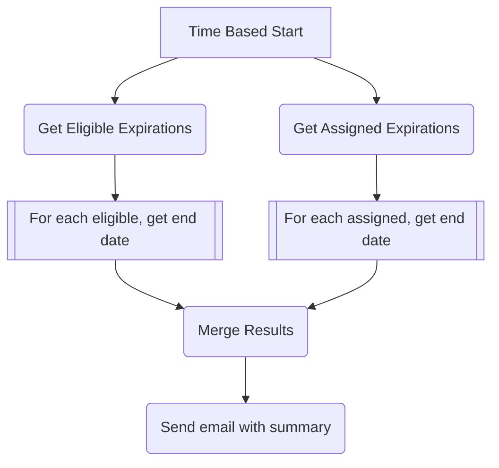

# Description
Azure Privileged Identity Management -- a.k.a. PIM -- can produce quite the large number of emails for Administrators to sift through and in a more complex environment where you are managing PIM assignments across multiple subscriptions and wanting to track upcoming expirations, its difficult to gain value out of the deluge of expiration notification messages that are coming in to your inbox.  The Azure Portal also falls a bit short in giving you a summarized view of all expirations across all Azure scopes/resources as you need to click into each relevant scope (e.g. Subscription, Resource Group) and view the specific assignments there-in to gain any insight.

This Logic App is meant to assist those responsible for reviewing the expirations so that updates/extensions can be processed *prior* to impacting a user or group of users being able to activate their relevant role(s) in the environment.

# Logic App Flow

